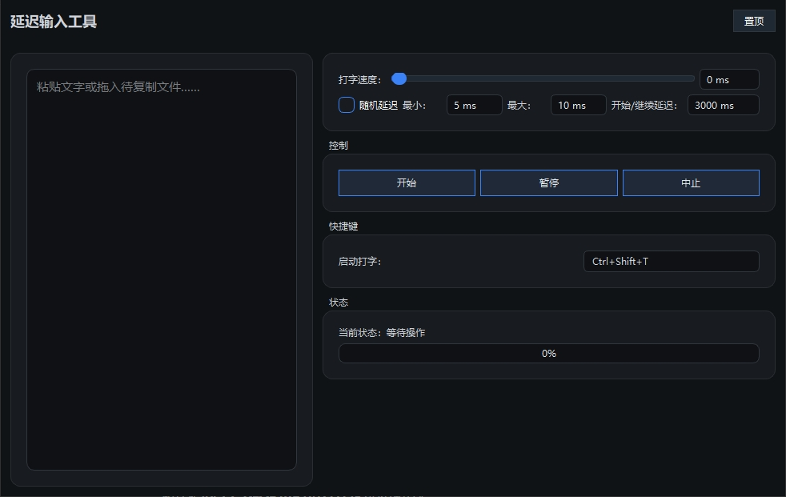

# DelayInput

一个基于 PyQt6 的桌面小工具，用于在目标窗口中模拟逐字输入，
支持延迟启动、随机打字间隔、暂停与恢复等能力，
适合在无法直接粘贴的场景下“半自动”输入长文本。

## 适用场景

- 跨端 VNC / 远程桌面 / 虚拟机等不支持共享剪贴板时，需要输入一长串命令
- 一些受限制的浏览器页面（禁用右键、禁用粘贴）中，快速输入大段文本
- 需要控制输入节奏（如演示、录屏）的场景

## 功能特性

- 支持粘贴文本或将文件拖入文本框，一键加载内容
- 可配置基础打字间隔，支持附加随机延迟，使输入更接近人工键入
- 支持开始前倒计时、暂停后延时继续
- 全局快捷键一键开始/继续/中止输入
- 自动检测当前窗口焦点，焦点变化时自动暂停，避免误输入
- 简洁的深色界面，全部设置在单一窗口中完成
